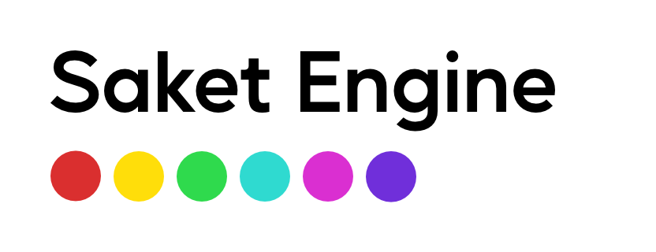

# Saket Engine

Saket Engine is Data Oriented Application Development Framework made for Games, Visualizations, Applications and Engineering.

I'm creating this engine/framework to build future software and games on top of. The current tooling and GUI is simply not fit for my planned usecases.
Therefore I'm building everything from scratch and learning as I go. Hopefully other people will also get to use it some day when it gets stable. Do note that I'm not afraid of deleting large parts of the codebase or rewriting it all in another language is nesscary. There will never be deprecated features, stuff will just get deleted.
Also I'm still unsure how Open Source Software actually works with contributions etc. For now Github is just sparsely used backups for me. 

Since I'm still in the early stages I'm still unsure about the scope of the engine. If I want this to be a fully featured game engine or a lightweight framework.

Currently it fully embraces .Net ecosystem. It for example is always using the newest version of .Net and is exclusively uses the built in numerics instead of a custom math library. That might however change in the future. Some modules might be made in C for true cross compatibility.

## Current Features

- Fully Managed C# Entity Component System (ECS) System.
- WebGPU Bindings
- Win32 Windowing
- ECS Networking

## External Dependencies

- WebGPU
- StbImageSharp [Temporary]

Windows:
- user32.dll, kernel32.dll

## Examples
Example game made in the engine. Is inspired by and uses assets of Wilmots warehouse:

## Roadmap

## Supported File Types

I want to support a wide array of common filetypes within the engine. However I do not want to bloat the base engine with unnessary support.
These might end up in other software built on top. If you're building software you might want to use export functionality. My thinking is if you're already supporting importing, exporting will not be that hard to add.

🚀: Polished and ready for the moon

✔️: Completed (Usable state)

🚧 : In progress

⌚: Planned In the near future

🤔: Under Consideration

❌: Not planned

| Image  | Import | Export | 
|---|
| PNG (stb_image) | ✔️  | 🤔 |
| JPG  | 🤔  | 🤔 | 
| SVG  | 🤔  | 🤔 |

| Audio  | Import | Export | 
|---|
| WAV  | ⌚  | 🤔 |
| MP3  | 🤔  | 🤔 |
| OGG  | 🤔  | 🤔 |

| Fonts  | Import | Export | 
|---|
| TrueType (.ttf)  | 🚧  | 🤔 |
| OpenType (.otf) | 🚧  | 🤔 |
| Web Open Font Format (.woff) | 🚧  | 🤔 |

| Text  | Import | Export | 
|---|
| JSON (Newtonsoft.Json) | ✔️  | ✔️ |
| XML (System.XML)  | ✔️  | ✔️ |
| CSS (for svg) | 🤔  | 🤔 |

## Supported Platforms

| Platform  |
|---|
| Windows  | 🚧  |
| MacOS  | ⌚  |
| Linux  | ⌚  |
| Switch  | ⌚  |
| Android  | ⌚  |
| IOS  | 🤔  |
| Xbox  | 🤔  |
| Playstation  | 🤔  |

